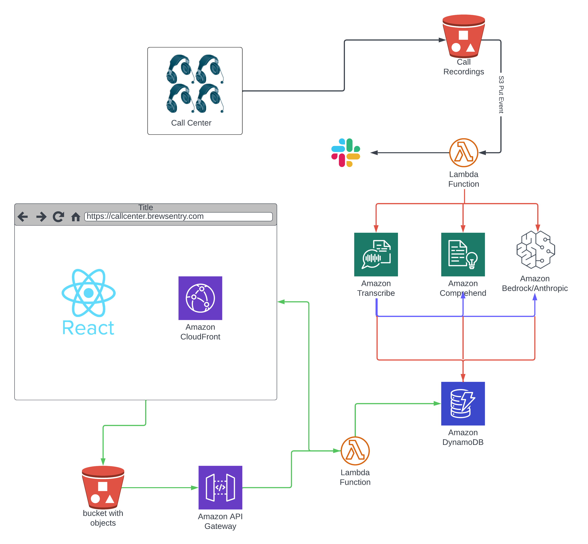

# AWS Call Center AI

This repository contains the infrastructure and application code for an automated AI-driven call center analysis tool. Calls are processed, transcribed, analyzed for sentiment, summarized, and then stored for access through a React-based frontend.

## Architecture



### Overview

1. **Call Center**: Drops an MP3 recording of a call into an S3 bucket.
2. **AWS Lambda**: Initiates the transcription of the call using Amazon Transcribe.
3. **Sentiment Analysis**: The call transcription is broken up into sections and analyzed for sentiment using Amazon Comprehend.
4. **Summarization**: The entire transcription is summarized by an Amazon Bedrock/Anthropic Large Language Model (LLM).
5. **Storage**: The processed data is stored in Amazon DynamoDB.
6. **Frontend**: A React application displays the information on a website served through Amazon CloudFront and API Gateway.

## Folder Structure

```plaintext
.
├── README.md
├── images
│   └── architecture.png
├── recordings
│   ├── [date-time].txt files
│   ├── create_recordings.py
│   ├── mp3s
│   │   ├── [date-time].mp3 files
│   ├── myenv
│   │   ├── Virtual environment directories
│   └── requirements
└── terraform
    ├── *.tf Terraform modules
    ├── lambda_frontend
    │   └── frontend.py
    ├── lambda_ingest
    │   ├── ingest.py
    │   └── requirements.txt
    ├── static-site
    │   ├── README.md
    │   ├── build
    │   ├── package-lock.json
    │   ├── package.json
    │   ├── public
    │   └── src
    ├── terraform.tfvars
    ├── variables.tf
    └── versions.tf
```
## Usage

The system consists of several components that need to be set up and deployed. Below are the instructions for each component:

### Call Recordings

- Place call recording MP3 files in the `recordings/mp3s` directory.
- To generate call recordings, run the `create_recordings.py` script located in the `recordings` folder.
    ```bash
    cd recordings
    python create_recordings.py
    ```
- This script allows you to create multiple simulated call recordings. The MP3 files will be output into the `recordings/mp3s` subfolder.
- Before running the script, ensure that the Python environment is set up and dependencies are installed:
    ```bash
    cd recordings
    pip install -r requirements.txt
    ```

### Terraform

- Apply the Terraform configuration to set up the AWS infrastructure. Make sure you have Terraform installed and configured correctly.
- Navigate to the `terraform` directory and initialize the Terraform configuration:
    ```bash
    cd terraform
    terraform init
    ```
- Create a plan from the Terraform scripts
    ```bash
    terraform plan -out=plan.out
    ```
- Apply the configuration to create the infrastructure:
    ```bash
    terraform apply plan-out
    ```

## React Frontend

- Navigate to the `static-site` directory to work with the React application.
- Install the dependencies listed in `package.json`:
    ```bash
    cd static-site
    npm install
    ```
- Build the React application:
    ```bash
    npm run build
    ```
- The built static files will be placed in the `build` directory. 
- Terraform is configured to upload the built static files to the appropriate AWS services.

## AWS Credentials

- Ensure you have the required AWS credentials and permissions set up before attempting to deploy the infrastructure.
- Set up your AWS credentials by configuring the AWS CLI:
    ```bash
    aws configure
    ```
- Follow the prompts to input your AWS Access Key ID, Secret Access Key, region, and output format.

## Notes

- Make sure all scripts and commands are executed with the necessary permissions and from the correct directory within the project.
- Review and adjust `terraform.tfvars` to match your specific AWS setup and requirements before applying the Terraform configuration.
- Keep your AWS credentials secure and do not commit them to your repository.

After completing these steps, the system should be fully set up and the AI-driven call center analysis tool should be operational.


### Dependencies
* AWS CLI
* Terraform
* Python
* React.js
