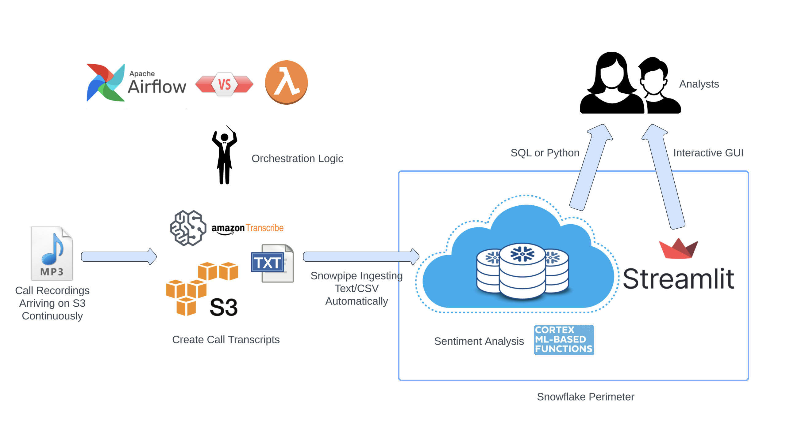

# Call Center AI in Snowflake

This folder contains a demo for Call Center Analysis solution implemented in Snowflake and its built-in Streamlit GUI tool. The goal is to show customers how to brainstorm to apply AI (LLM) concepts to their data.

The end user perspective is captured in this file - Call Center Analysis GUI in Streamlit.pdf

## Architecture

